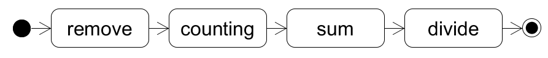

# AWS Lambda Fusion Automation

This script fuse source functions that compose a workflow into a single big function.


## Installation

1. Clone this repository.

2. Install dependencies.

   ```bash
   npm ci
   ```
   
3. Run the script code.

   ```bash
   npm run fuse
   ```

   

## How to use

1. Write a function chain specification. A function chain specification describes your workflow structure. You can see the document of the schema of the function chain specification [here](https://henry174ajou.github.io/AWS-Lambda-Fusion-Automation/)
   
2. Pack the source functions in the same directory with the following directory structure.

   ```
   source_function_root/
   ├─ functionA/
   │  ├─ index.js
   ├─ functionB/
   │  ├─ index.js
   ├─ functionC/
   │  ├─ index.js
   │  ├─ node_modules/
   ```
   The name of the function chain specification and soruce function root directory can be any name you want. Each source function has its own directory in the source function root directory. If a source function has dependencies, it should be put in the source function directory (like function C).
   
3. Start the script by `npm run fuse` in the project root. You can also directly run the script file `dist/index.js`.

4. Input the path of the function chain specification.

5. The fusion result is written in the `result` directory, the exact location as the function chain specification.

6. Archive the result directory as a zip file, and upload it to AWS Lambda.

## Follow the sample code.

There are some sample source functions and sample function chain specifications in the `sample` directory. You can test this program using the samples. Let's try the automation program using _sequence4_ workflow.



This workflow contains four functions and intermediate states to transform the message between functions.

### Write a function chain specification

The following YAML is a function chain specification that describes the above workflow.

```YAML	
functionInfo:
  - handlerFileName: index.js
    handlerFunctionName: handler
    functionId: remove
    handlerRootFolder: removingZeroAndNegative
    executionTime: 2
  - handlerFileName: index.js
    handlerFunctionName: handler
    functionId: counting
    handlerRootFolder: counting
    executionTime: 2
  - handlerFileName: index.js
    handlerFunctionName: handler
    functionId: sum
    handlerRootFolder: numberListSum
    executionTime: 2
  - handlerFileName: index.js
    handlerFunctionName: handler
    functionId: divide
    handlerRootFolder: divider
    executionTime: 2

chain:
  - type: function
    functionId: remove
  - type: converter
    rules:
      - from: numberList
        to: list
  - type: function
    functionId: counting
    mergeInputAndOutput: true
  - type: converter
    rules:
      - from: in.list
        to: numberList
      - from: out.count
        to: count
  - type: function
    functionId: sum
    mergeInputAndOutput: true
  - type: converter
    rules:
      - from: in.count
        to: denominator
      - from: out.sum
        to: numerator
  - type: function
    functionId: divide
```

You can write a function chain specification using JSON or YAML. The first property of root object is `functionInfo`. The `functionInfo` property is a list of `FunctionInfo` object. `FunctionInfo` object contains the information about a source function. You should provide five information to describe your source function. A handler file name, a handler function name, a handler root folder name, the function id, and the execution time of the function. For more syntax information, you can see the document.

The second property of root object is `chain`. The `chain` property is a list of `ChainItem`. The `ChainItem` describe each step of a workflow. Hence, the `chain` property describe the structure of a workflow. The parameter of the fused function is passed to the first chain item. The result of the last chain item will be the result of a fused function.


### Make a fused function.

To generate a fused function, run the following script in the project root.

```bash
npm run fuse
```

If you see the dependency error, check that you install the dependency by `npm ci`.

If it success, the interactive CUI will be started. 

```
working directory: xxxxx\AWS-Lambda-Fusion-Automation
function specification file path:
```

Check the working directory path. This path is the root path of a function chain specification. Type `sample/sequence4.yaml`.

```
working directory: xxxxx\AWS-Lambda-Fusion-Automation
function specification file path: sample/sequence4.yaml
the path of a directory that contains source functions:
```

The second question is where is the source functions. Type `sample/source_function`.

```
working directory: xxxxx\AWS-Lambda-Fusion-Automation
function specification file path: sample/sequence4.yaml
the path of a directory that contains source functions: sample/source_function
inspect on? (y/n):
```

The program asks you if you will activate the survey mode. If you say "y", the fused function that will be generated prints all intermediate messages as a log. Type "y" or "n" as you want.

After the last question, the automation will be started.

```
 i INFO  process started at 2021-11-01T16:15:55+09:00
 √ SUCCESS  [1/4] The function chain specification is parsed.
 √ SUCCESS  [2/4] Function source codes to fuse are loaded.
 √ SUCCESS  [3/4] The fusion function is generated.
 √ SUCCESS  [4/4] All artifacts are stored at xxxxx\AWS-Lambda-Fusion-Automation\result
 √ SUCCESS  all process doen in a few seconds (ended at 2021-11-01T16:15:55+09:00)
```

You can see the fused function in `result` directory. `index.js` it is. The handler name is `handler`.

## Function Chain Specification Document

[https://henry174ajou.github.io/AWS-Lambda-Fusion-Automation/]()